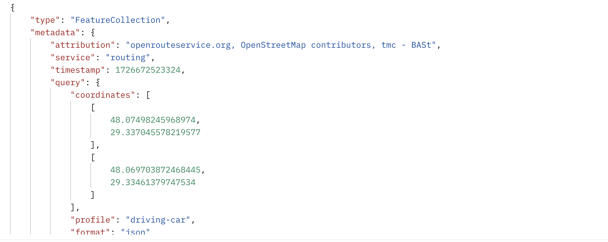

# Openrouteservice

This is a complementary sample repository for the outstanding Openrouteservice repository.
The goal of the repo is to help other people with their openrouteservice journey while wrangling docker.
Full credit to the [Openrouteservice](https://github.com/GIScience/openrouteservice)


## 1 - Installation

You can easily [run openrouteservice](https://giscience.github.io/openrouteservice/run-instance/) yourself! 

**tl;dr:** We suggest [using docker](https://giscience.github.io/openrouteservice/run-instance/running-with-docker) to install and launch openrouteservice. 
In short, a machine with a working [docker installation](https://www.digitalocean.com/community/tutorial_collections/how-to-install-and-use-docker) will get everything done for you. 


## 2 - Use case


The use case is simple: Run openrouteservice for the GCC states and find the location between 2 points on the map - Both points will be located in Salmiya, Kuwait.


## 3 - Running with a custom map


Under /data you can find 3 important folders. \
These folders will be shared with the docker instance as volumes specified on the **docker-compose.yml** file

### 3.1 - The configuration file
- **data/config** will host a very basic configuration file with a profile for cars:
```yaml
ors:
  engine:
    source_file: /home/ors/files/gcc-states-latest.osm.pbf
    profiles:
      car:
        profile: driving-car
        enabled: true
```


### 3.2 - The map file

- **data/files** will hold the desired map. You can download other regional maps from [Geofabrik](https://download.geofabrik.de/).


### 3.3 - The mount folder

- **data/mount** - Will hold generated graph data.


## 4 - Run the instance

Start openrouteservice in the background:
```shell
docker compose up --build -d
```

Give it a few minutes as the system builds the graph and loads all data into memory.


Run a simple test and check the output:

```shell
curl --request GET http://localhost:8080/ors/v2/directions/driving-car?start=48.07498245968974,29.337045578219577&end=48.069703872468445,29.33461379747534
```
You should be able to see something along the lines of:




Stop the container with:
```shell
docker compose down
```


## 5 - API Usage

The above mentioned endpoints will be available on port 8080 (container) and 8082 (mapped port on host):

- `http://localhost:8080/ors/v2/directions`
- `http://localhost:8080/ors/v2/isochrones`
- `http://localhost:8080/ors/v2/matrix`
- `http://localhost:8080/ors/v2/snap`
- `http://localhost:8080/ors/v2/export`
- `http://localhost:8080/ors/v2/health`
- `http://localhost:8080/ors/v2/status`

You can find more information in the endpoint documentation pages linked above.

On the [API Reference](https://giscience.github.io/openrouteservice/api-reference/) there is also a description
how you can use the Swagger-UI and the API Playground for local instances of openrouteservice.
