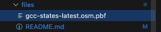

Since the file size may vary between hundreds of mb and several gbs, it is recommended you download your specific files from [Geofabrik](https://download.geofabrik.de).

The map used for this example will be hosted [here](https://download.geofabrik.de/asia/gcc-states-latest.osm.pbf).

Folder constitution example:

